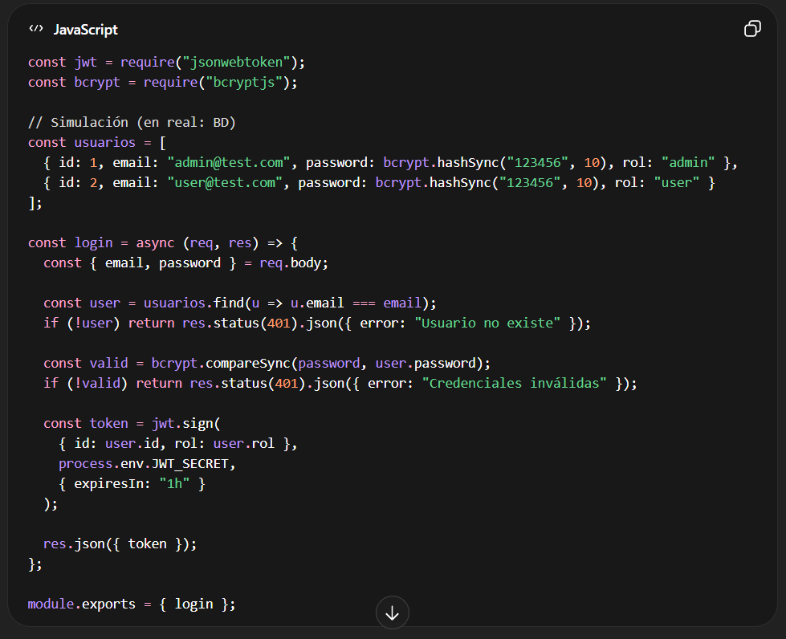
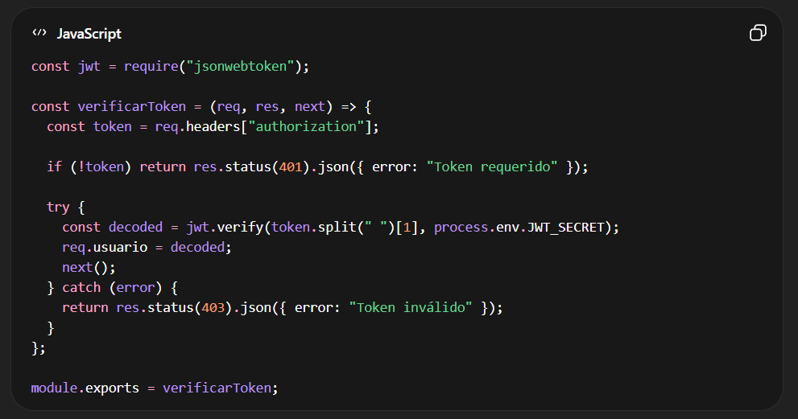
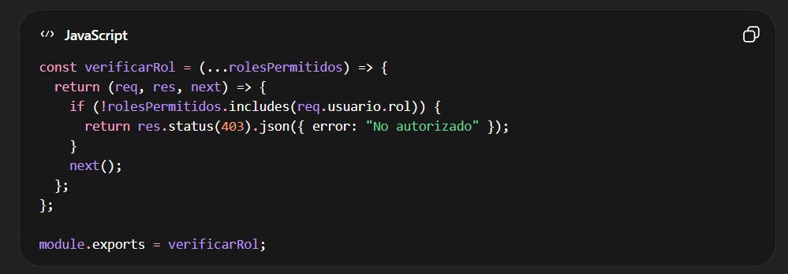
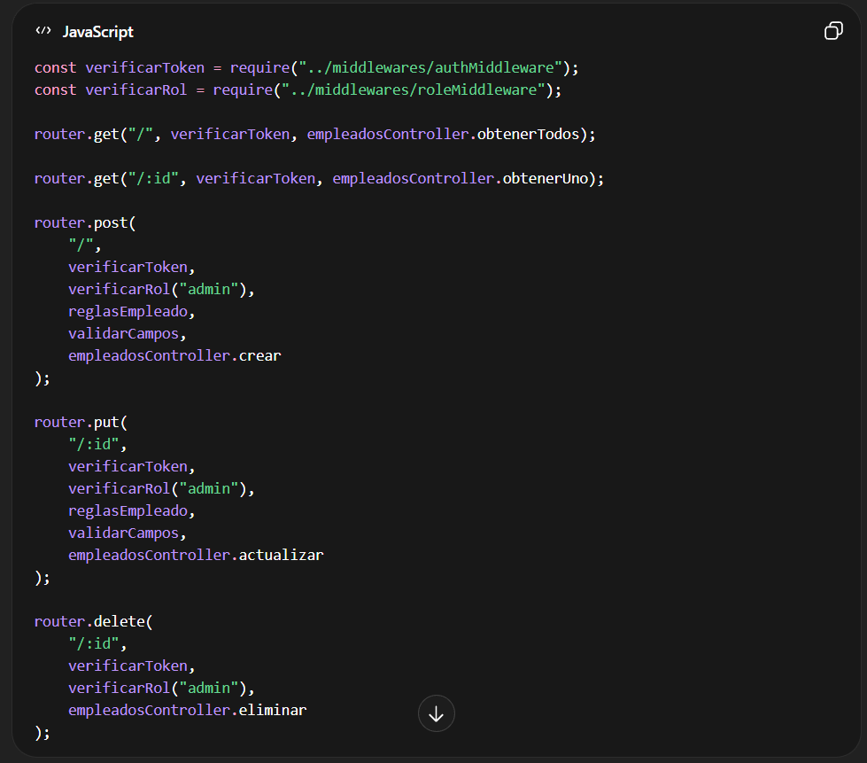
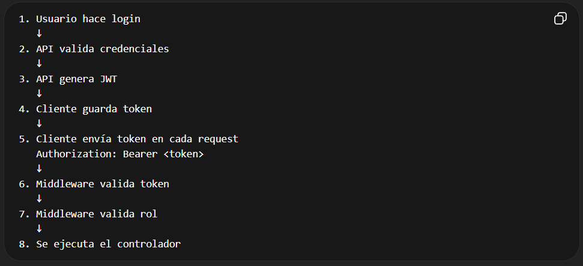

# Es te es un modelo de aplicación de Seguridad a un API

Lo que se pide en entrevistas y proyectos reales: pasar de una API CRUD a una API segura con autenticación y autorización por roles.

Te voy a dejar:

✅ Explicación clara (nivel entrevista)
✅ Cómo aplicarlo a TU proyecto
✅ Flujo completo
✅ Archivo INFO.md listo para usar

---
🔐 1. Conceptos Clave
🧩 Autenticación (Authentication)

Responde a la pregunta:

¿Quién eres?

Es el proceso de validar la identidad de un usuario.

Ejemplos:
Usuario + contraseña
OAuth (Google, Microsoft)
JWT
En tu caso: JWT

JWT (JSON Web Token) es un token firmado que contiene información del usuario:
```js
{
  "id": 1,
  "email": "admin@test.com",
  "rol": "admin"
}
```

👉 Se genera al hacer login
👉 Se envía en cada request

---

🛂 Autorización (Authorization)

Responde a la pregunta:

¿Qué puedes hacer?

Aquí decides:

| Rol   | Permisos                |
| ----- | ----------------------- |
| admin | crear, editar, eliminar |
| user  | solo consultar          |

---
🔄 Alternativa a JWT

Otra opción común:

🔹 Sessions (Estado en servidor)
Guarda sesión en memoria/Redis
Usa cookies

| JWT        | Sessions        |
| ---------- | --------------- |
| Stateless  | Stateful        |
| Escalable  | Menos escalable |
| Ideal APIs | Ideal apps web  |

👉 Para APIs modernas: JWT es estándar

# 🏗️ 2. Cómo aplicarlo a TU proyecto

Vamos a agregar:

```
middlewares/
 ├── authMiddleware.js   👈 valida token
 ├── roleMiddleware.js   👈 valida rol

controllers/
 ├── authController.js   👈 login

routes/
 ├── authRoutes.js       👈 login endpoint
```


🔑 3. Autenticación (Login + JWT)

---

 # 🔑 3. Autenticación (Login + JWT)
📌 Instalar

npm install jsonwebtoken bcryptjs

📌 Ejemplo authController.js



---

📌 Middleware de autenticación



📌 Middleware de autorización (roles)



🔐 4. Proteger tus rutas
✨ Modificar empleadosRoutes.js



🔄 5. Flujo completo

